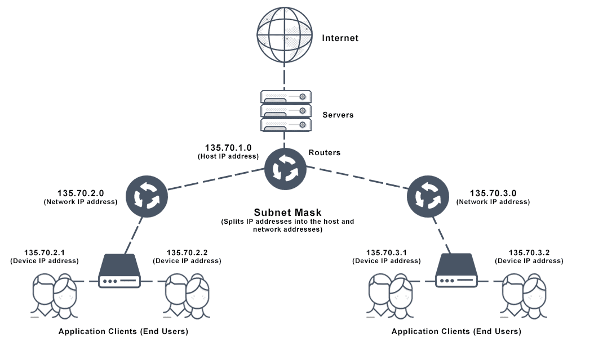

# Mask

The device called a gateway or default gateway connects local devices to other networks. This means that when a local device wants to send information to a device at an IP address on another network, it first sends its packets to the gateway, which then forwards the data on to its destination outside of the local network.

The `“255”` address is always assigned to a broadcast address, and the `“0”` address is always assigned to a network address. Neither can be assigned to hosts, as they are reserved for these special purposes.

You can determine based on the three high-order or left-most bits in any given IP address which of the five different classes of networks, A to E, the address falls within.

Class A, B, and C networks have natural masks, or default subnet masks:

- Class A: 255.0.0.0
- Class B: 255.255.0.0
- Class C: 255.255.255.0

## How to calculate CIDR

Example: `192.168.1.0/24`
=>  ipv4(`32bit`)   => `32-24=8`
=>  host            => `2^8=256`
=>  range           => `192.168.1.1 <-> 192.168.1.254`
=>  subnet          => `192.168.1.0`
=>  broadcast       => `192.168.1.255`

More you increase the `/XX`, smaller the number of host will comes.

## Subnet Mask Cheat Sheet

| CIDR | Dot-decimal     | Number of IP-addresses  per subnet | Usable IP-addresses   per subnet | Number of subnets |
|------|-----------------|------------------------------------|----------------------------------|-------------------|
| /32  | 255.255.255.255 | 1                                  | 0                                | 256               |
| /31  | 255.255.255.254 | 2                                  | 0                                | 128               |
| /30  | 255.255.255.252 | 4                                  | 2                                | 64                |
| /29  | 255.255.255.248 | 8                                  | 6                                | 32                |
| /28  | 255.255.255.240 | 16                                 | 14                               | 16                |
| /27  | 255.255.255.224 | 32                                 | 30                               | 8                 |
| /26  | 255.255.255.192 | 64                                 | 62                               | 4                 |
| /25  | 255.255.255.128 | 128                                | 126                              | 2                 |
| /24  | 255.255.255.0   | 256                                | 254                              | 1                 |
| /21  | 2048            | 2046                               | 255.255.248.0                    | 8                 |
| /20  | 4096            | 4094                               | 255.255.240.0                    | 16                |
| /19  | 8192            | 8190                               | 255.255.224.0                    | 32                |
| /18  | 16384           | 16382                              | 255.255.192.0                    | 64                |
| /17  | 32768           | 32766                              | 255.255.128.0                    | 128               |
| /16  | 65536           | 65534                              | 255.255.0.0                      | 256               |

[<- back to summary](/README.md)
